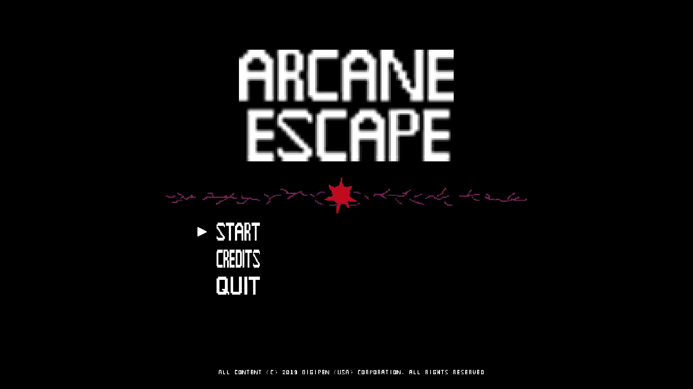

<!-- PROJECT LOGO -->
 

    
  </a>

  <h3 align="center">My Freshman Year Spring Team Game Project</h3>

  

    <a href="https://youtu.be/kTYDAe2NLkc">Demo video</a>
  

<!-- TABLE OF CONTENTS -->

  
Table of Contents

  <ol>
    <li>
      <a href="#about-the-project">About The Project</a>
      <ul>
        <li><a href="#built-with">Built With</a></li>
      </ul>
    </li>
    <li>
      <a href="#roadmap">Roadmap</a>
    </li>
    <li><a href="#copyright">Copyright</a></li>
    <li><a href="#contact">Contact</a></li>
  </ol>

<!-- ABOUT THE PROJECT -->
## About The Project

![Product Name Screen Shot][product-screenshot]

This project is my first custom engine game project. I learned how object oriented game engine communicate and execute among its systems.  

The game is a "single player 2D pixel art side-scrolling fantasy action-platformer with puzzle-like elements including multiple spells interacting with environment."

### Built With

This project was build upoun the game engine frame work made by professor [Doug Schilling](https://www.linkedin.com/in/doug-schilling-5920a74/).

<!-- ROADMAP -->
## Roadmap

List of features I implemented for this project.

* behavior system and various monster behavior
* collider
* monster manager and various monster class

<!-- copyright -->
## Copyright

Copyright © 2019 DigiPen, All rights reserved.

<!-- CREDITS -->
## Credits

<!-- CONTACT -->
## Contact

Garry Chen

 

<!-- MARKDOWN LINKS & IMAGES -->
<!-- https://www.markdownguide.org/basic-syntax/#reference-style-links -->
[linkedin-url]: https://linkedin.com/in/othneildrew
[product-screenshot]: pic/Sell%20Sheet.png

